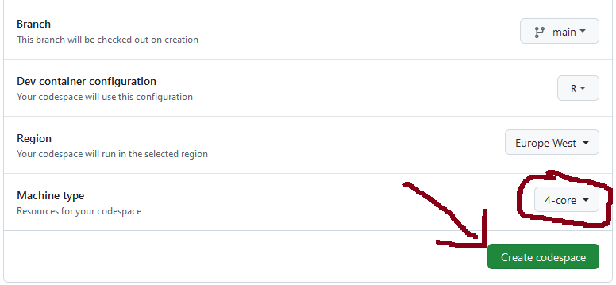

## README

This repository is associated with the paper *Non-separable
spatio-temporal Poisson point process models for fire occurrences* by
Nicoletta D’Angelo, Alessandro Albano, Andrea Gilardi, and Giada
Adelfio. It contains the code and the data necessary to reproduce the
analyses presented in the manuscript.

In particular:

- The `R` code used to create the exploratory analyses included in
  Sections 2 and 4 and estimate the model detailed in Section 3 can be
  found in `summary.R`.
- The file `summary.html` (generated by `summary.qmd`) contains a
  notebook-like summary of the analyses in HTML format which already
  includes all code and figures.
- Finally, we have also prepared a [Github
  Codespace](https://github.com/features/codespaces) that can be used to
  automatically set-up an Rstudio Server and explore the code and the
  data in an interactive way.

Instructions to access the Github Codespace[^1]:

1.  Click on the following link to set-up your own version of the
    Codespace: <https://codespaces.new/agila5/ppm-fire-occurrences>.
    **Warning:** the `Machine type` option needs to be set equal to
    `4-core`.
2.  Click on the green button named `Create codespace`.
    
3.  Wait for the Codespace to be created. This operation takes
    approximately 5/10 minutes. At the end you should see something
    like:

[^1]: Please note that you need a Github account to access the Github
    Codespace.
